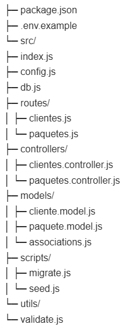
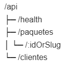

# Agencia de Viajes – API (ESM + Sequelize + MySQL)

API REST para **clientes** y **paquetes de viaje**. Pensada para **DB en Railway (MySQL)** y **deploy en Render**.  
El frontend consume endpoints públicos con CORS controlado.

---

## 🧱 Stack

- **Node 20** (ES Modules)
- **Express**, **Sequelize** + **mysql2**
- **Helmet**, **CORS**, **Morgan**
- Migración/seed **ESM** (scripts propios, sin `sequelize-cli` en runtime)
- Contenedor: **Dockerfile** multi-stage

---

## 📁 Estructura (resumen)



---

## 🚦 Rutas base



---

## ⚙️ Quick start (local)

```bash
cd server
cp .env.example .env             # edita credenciales 
npm i
npm run migrate                  # crea tablas (idempotente)
npm run seed                     # inserta paquetes + clientes demo (solo si están vacías)
npm run dev                      # http://localhost:3001
```
Chequeo de salud

```

curl http://localhost:3001/api/health
# -> { "ok": true }

```
### ✅ Reglas de validación

- nombre requerido (1–120)
- email con formato válido

- numero_personas > 0

- fecha_viaje futura en formato YYYY-MM-DD

- Si envías paquete_id, debe existir; destino se establece con el titulo del paquete

### 🔌 API Reference
#### ```GET /api/health```

```
curl https://TU-API.onrender.com/api/health
# -> { "ok": true }

```

#### ```GET /api/paquetes```
Lista de paquetes (orden ASC por id).
```
curl https://TU-API.onrender.com/api/paquetes
```
Ejemplo:

```
[
  {
    "id": 1,
    "slug": "cancun-all-inclusive",
    "titulo": "Cancún All-Inclusive",
    "destino": "Cancún, México",
    "duracion_dias": 5,
    "duracion_noches": 4,
    "incluye": ["Hospedaje","Vuelos redondos","Transporte","Tours","Comidas y bebidas ilimitadas"],
    "precio_mxn": 15000,
    "imagen_url": "https://example.com/img/cancun.jpg"
  }
]

```

#### ```GET /api/paquetes/:idOrSlug```
```
curl https://TU-API.onrender.com/api/paquetes/cancun-all-inclusive
curl https://TU-API.onrender.com/api/paquetes/1
```
#### ```GET /api/clientes```
```
curl https://TU-API.onrender.com/api/clientes
```

#### ```POST /api/clientes```

Body (recomendado: con paquete_id)

```
{
  "nombre": "Juan Pérez",
  "email": "juan.perez@example.com",
  "paquete_id": 1,
  "numero_personas": 2,
  "fecha_viaje": "2025-12-20",
  "comentarios": "Habitación con vista al mar"
}

```
Body (alternativo: sin paquete_id, usando destino texto)
```
{
  "nombre": "Carla Gómez",
  "email": "carla.gomez@example.com",
  "destino": "Europa en 15 días",
  "numero_personas": 1,
  "fecha_viaje": "2026-01-10"
}
```


Ejemplo(201):
```
{
  "id": 13,
  "nombre": "Juan Pérez",
  "email": "juan.perez@example.com",
  "destino": "Cancún All-Inclusive",
  "paquete_id": 1,
  "numero_personas": 2,
  "fecha_viaje": "2025-12-20",
  "comentarios": "Habitación con vista al mar",
  "created_at": "2025-09-09T18:00:00.000Z",
  "Paquete": {
    "id": 1,
    "slug": "cancun-all-inclusive",
    "titulo": "Cancún All-Inclusive",
    "precio_mxn": 15000
  }
}

```
#### Errores comunes
```
{ "error": "Faltan campos obligatorios" }
{ "error": "Email inválido" }
{ "error": "Número de personas inválido" }
{ "error": "La fecha debe ser futura (YYYY-MM-DD)" }
{ "error": "paquete_id no válido" }
```